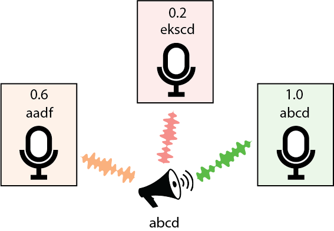

## MicRank: Learning to Rank Microphones for Channel Selection

<div align="center">


### Application Scenario

Many applications nowadays envision the presence of multiple heterogeneous recording devices (e.g. [Microsoft Project Denmark](https://www.microsoft.com/en-us/research/project/project-denmark/), 
[CHiME-5](http://spandh.dcs.shef.ac.uk/chime_challenge/CHiME5/data.html), [CHiME-6](https://chimechallenge.github.io/chime6/) and [Voices from a Distance](https://arxiv.org/abs/1902.10828) Challenges, [DIRHA project](https://dirha.fbk.eu/) et cetera).

Audio signals captured by different microphones can be suitably combined at front-end level by using **beamforming techniques**. 
However this combination could be **very challenging** as **in an ad-hoc microphone network** microphones can be very far from each other. 
Moreover some could be close to noise sources or, for a particular utterance, too far from the speaker to be of any usefulness and, to 
further complicate things, synchronization issues may appear. 

An intriguing approach could be to select only the best microphone for each utterance or instead to **select only a promising subset** of 
microphones for beamforming or ROVER combination, thus potentially saving resources and/or improving results by excluding "bad" channels.
This can be performed by suitable automatic **Channel Selection** or **Channel Ranking** algorithms.

### What is MicRank

MicRank is a **Learning to Rank neural channel selection framework** where a **DNN is trained to rank microphone channels based on ASR-backend performance** 
or any other metric/back-end task (e.g. STOI if one wishes to rank microphones based on speech intelligibility et cetera).

It is **agnostic with respect to the array geometry and type of recognition back-end** and it 
does **not require sample-level synchronization between devices**. 

Remarkably, it is able to considerably improve over previous selection techniques, 
reaching **comparable and in some instances better performance than oracle signal-based measures** like PESQ, STOI or SDR. 
This is achieved with a very small model with only 266k learnable parameters, making this method much more **computationally efficient**
than decoder or posterior based channel selection methods.


### LibriAdHoc Synthetic Dataset Recipe

Coming Soon 

---

## citing MicRank
If this code has been useful, use this :
```BibTex
@inproceedings{todo,
    title={},
    author={Samuele Cornell and Alessio Brutti and Joris Cosentino and Sunit Sivasankaran and
            },
    year={2020},
    booktitle={},
}
```


